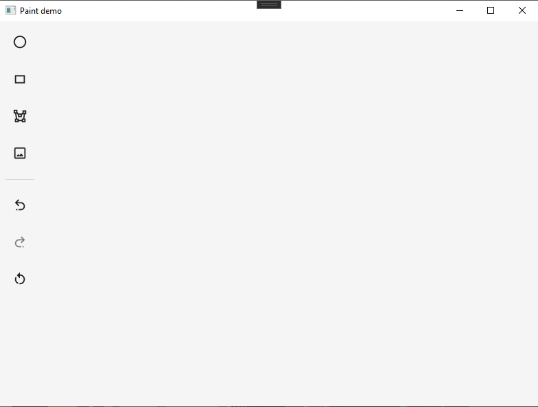

# Paint demo

Paint demo is a Windows desktop application used for drawing shapes.  
Apart from drawing, the application supports adding images.  

## Technologies used
- [WPF](https://docs.microsoft.com/en-us/visualstudio/designers/getting-started-with-wpf?view=vs-2019)  
- [Visual Studio](https://visualstudio.microsoft.com/)  
- [.NET Framework (min. 4.6.1)](https://dotnet.microsoft.com/download/dotnet-framework)  

## Preview
##### The application mainly consists of 2 main segments
- Canvas (Space for element drawing)  
- Toolbar (Shapes, Undo, Redo and Clear command)  

